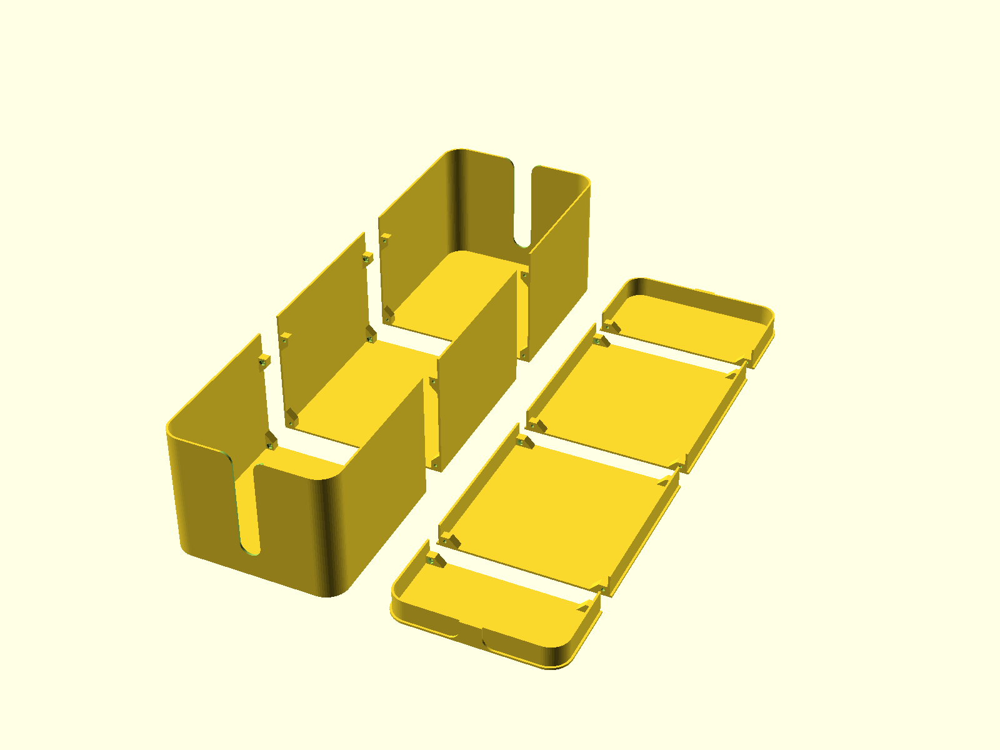

# Cable Box

A cable management box to store power supplies and tidy up cables.

The box and the lid are designed to be printed in multiple parts and assembled with M3 screws and nuts. This allows for printing on smaller printers such as the Prusa Mini.

This model is fully parametric and can be customized in OpenSCAD.

